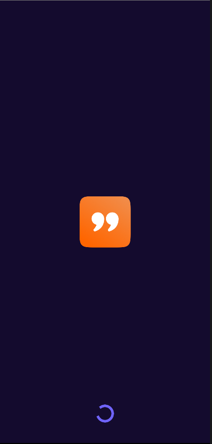
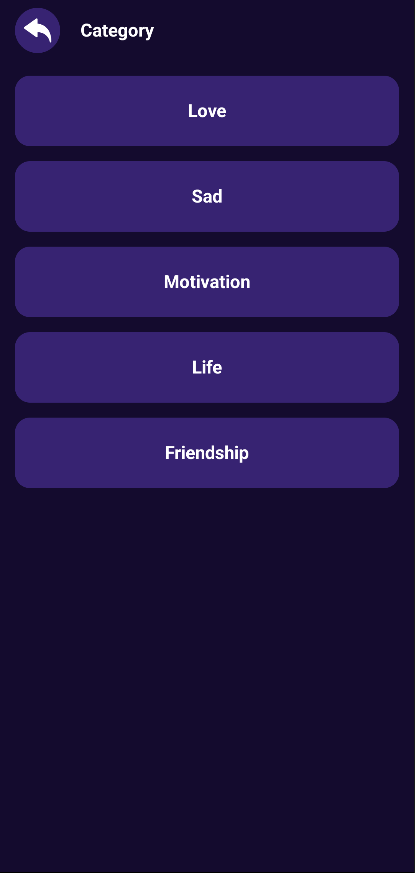
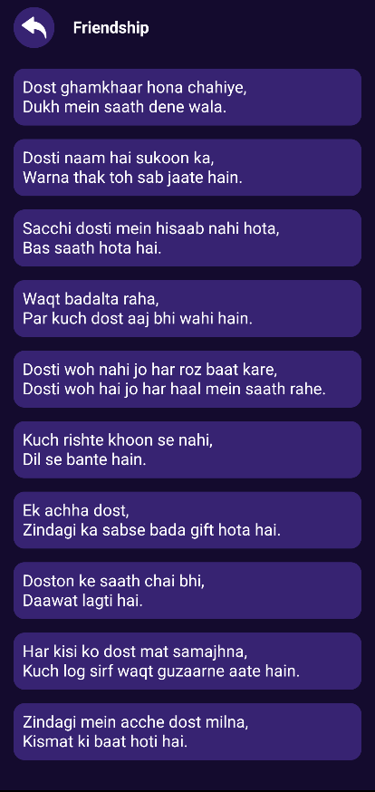

# 💟 ShayariApp

A Shayari browsing app built with **Jetpack Compose**.

---

## What is ShayariApp?

ShayariApp is a simple app to browse and share shayaris. Pick a category, scroll through the shayaris, tap one to read it in full, and share or copy it with a single tap.

---

## Features

- **Category Screen** — Choose from Love, Sad, Motivation, Life, and Friendship
- **Shayari List** — Scrollable list of shayaris for the selected category
- **Final View** — Tap any shayari to see it displayed on its own screen
- **Share** — Share any shayari directly to other apps
- **Copy** — Copy shayari text to clipboard in one tap
- **Splash Screen** — Branded entry screen with a loading indicator

---

## Screenshots

| Splash | Category | List | Final View |
|---|---|---|---|
|  |  |  |  |

---

## Tech Stack

| Layer | Technology |
|---|---|
| Language | Kotlin |
| UI | Jetpack Compose |
| Navigation | Navigation Compose |

---

## Project Structure

```
com.example.shayariapp/
├── Model/
│   └── ShayariModel.kt
├── Routing/
│   ├── ShayariRouting.kt
│   └── ShayariRoutingItem.kt
├── ui/
│   └── theme/
│       ├── Color.kt
│       ├── Theme.kt
│       └── Type.kt
├── CategoryScreen.kt
├── Common.kt
├── FinalShayariScreen.kt
├── ShayariListScreen.kt
├── SplashScreen.kt
└── MainActivity.kt
```

---

## Setup

```bash
git clone https://github.com/Vanshika-Tanwar/ShayariApp.git
```

Open in Android Studio, let Gradle sync, and run.

---

## What I learned building this

- Building a multi-screen app from scratch with Jetpack Compose
- Navigation Compose with a sealed class for type-safe routing
- Passing data between screens via navigation arguments
- Share intent and clipboard functionality in Compose
- LazyColumn for efficient list rendering

---

## Author

[**Vanshika Tanwar**](https://github.com/Vanshika-Tanwar)
